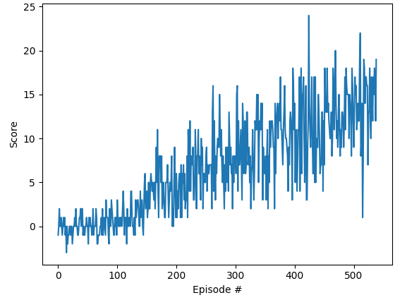

# Report

## How we solved the problem:

We used Deep Q Learning Network with Double DQN https://arxiv.org/abs/1509.06461 and dueling DQN https://arxiv.org/abs/1511.06581 tricks.

For the Q Learning (check q_learning.py)  we used as base the code provided in the DeepQ exercise including the Replay Buffer and the Agent base.

For the Q Network we used a multilayer network with hidden sizes 128 and 64, and we used Layer Normalization (https://arxiv.org/abs/1607.06450) which has proven to make training of Neural Networks faster and more stable.

We used the standard parameters from the DeepQ exercise in Udacity:
* Adam Optimizer
* BUFFER_SIZE = int(1e5) 
* BATCH_SIZE = 64
* GAMMA = 0.99
* TAU = 1e-3 
* LR = 5e-4 
* UPDATE_EVERY = 4 

## Plot of rewards

The Environment was solved in 439 episodes!

After training checkpoint.pth contains the parameter of the network.

## Ideas for the future

* Implement Prioritized Experience Replay
* Try TD3 https://spinningup.openai.com/en/latest/algorithms/td3.html#id1
* Try Cross Network https://arxiv.org/abs/2407.13349 which has proven to be more efficient at training more complicated functions with less parameters compared to regular DNN.

